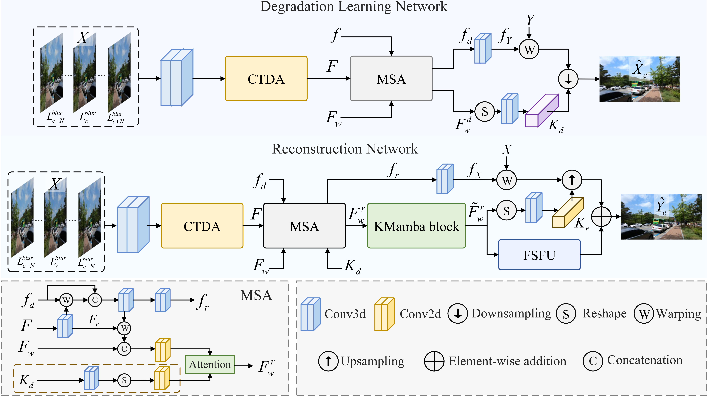

# STENet

The code of the paper "Spatio-Temporal Enhancement with Degradation Awareness for Blurry Video Super-Resolution".
This paper is currently under review.

<!--  -->

## Requirements
- Python 3.9
- PyTorch

## Datasets
- Training Datasets: [REDS](https://seungjunnah.github.io/Datasets/reds.html).

- Testing Synthetic Datasets: [REDS4](https://seungjunnah.github.io/Datasets/reds.html), [GoPro](https://seungjunnah.github.io/Datasets/gopro.html)

- Testing Real-World Datasets: [NCER](https://sites.google.com/view/neid2023)

## Training
```bash
python main.py --train --config_path experiment.cfg
```

## Testing
```bash
python main.py --test --config_path experiment.cfg
```

## Acknowledgement
Our code is built upon the video super-resolution method [FMA-Net](https://github.com/KAIST-VICLab/FMA-Net). Thanks to the code reference from:
- [RAFT](https://github.com/princeton-vl/RAFT)
- [VMamba](https://github.com/MzeroMiko/VMamba)
- [MambaIR](https://github.com/csguoh/MambaIR)